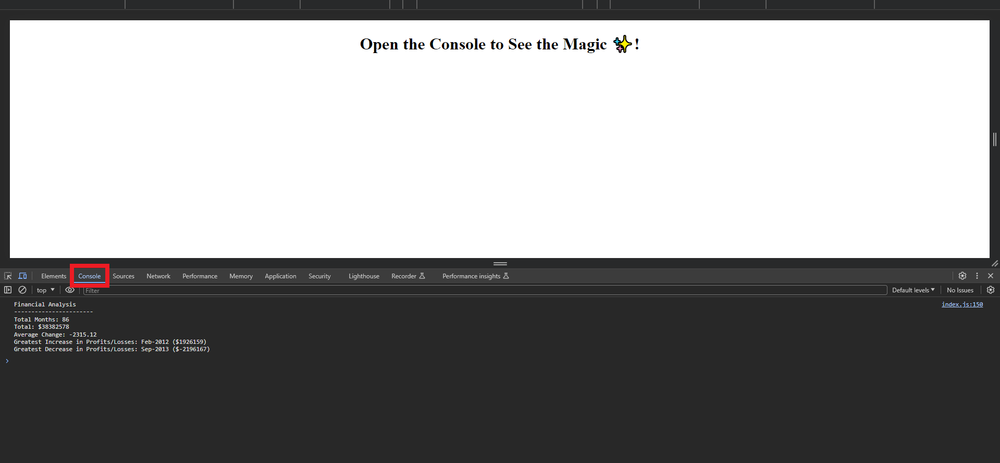

# Console-Finances

## Description

This repository contains a different exercise to my previous works. It's purpose was to practice javascript within the console log. Essentially my role was to crunch data arranged in a multidimensional array, something we hadn't yet come across in class. In that sense this was an extremely useful project for me. It helped me gain a lot of confidence in researching unfamiliar topics by myself, as well as learning about the math functions and other properties in Javascript. It helped that this project was almost entirely maths, something I'm a lot more comfortable with!

## Usage
This site has next to no functionality. It's merely to serve as a sandbox for practicing my JavaScript. If you wish to see the finished product, right click and inspect the page and enter the console to view the log. 

Link to site: https://sidm97.github.io/Console-Finances/

## Credits
Credit goes to the Skills Bootcamp that taught me how to use rudimentary Javascript. In addition, Mozilla's MDN docs and StackOverflow were both very useful in answering my questions along the way.

## License

I've used an MIT license

---